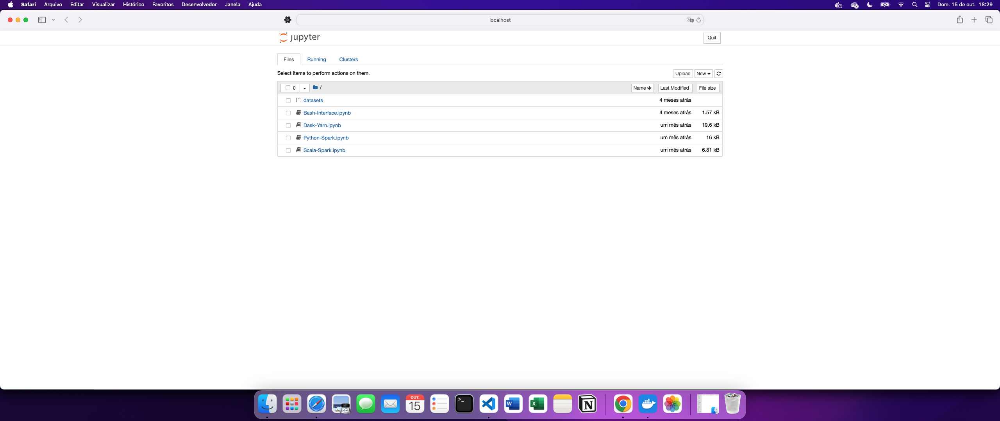

### Diretório do projeto

```
├── docker-compose.yml
├── Dockerfile
├── confs
│   ├── config
│   ├── core-site.xml
│   ├── hdfs-site.xml
│   ├── mapred-site.xml
│   ├── requirements.req
│   ├── slaves
│   ├── spark-defaults.conf
│   └── yarn-site.xml
├── datasets
│   ├── alice_in_wonderland.txt
│   └── iris.csv
├── notebooks
│   ├── Bash-Interface.ipynb
│   ├── Dask-Yarn.ipynb
│   ├── Python-Spark.ipynb
│   └── Scala-Spark.ipynb
└── script_files
    └── bootstrap.sh
```

### Criar imagem do container

```bash
docker build . -t cluster-base
```

### Inicialize o cluster

```bash
docker-compose up -d
```

### Yarn resource manager UI

Acesse o Yarn resource manager UI usando o link: http://localhost:8088/cluster/nodes


### Jupyter Notebook 

Acesse o Jupyter Notebook usando o link : http://localhost:8888/



### Encerre o cluster

```
docker-compose down
```

